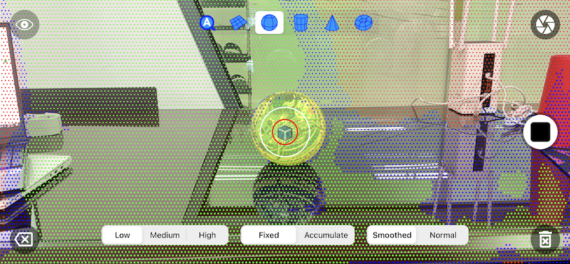
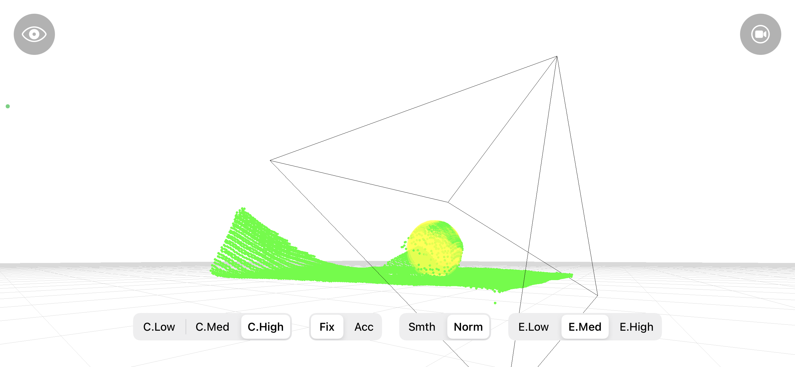

# FindSurface-GUIDemo-iOS (Swift)

**Curv*Surf* FindSurface™** GUIDemo for iOS (Swift)

## Overview

This demo app demonstrates a real-time application using FindSurface to search point clouds, which ARKit provides, for geometry shapes. 

[FindSurfaceFramework](https://github.com/CurvSurf/FindSurface-iOS) is required to build the source code into a program. Download the framework [here](https://github.com/CurvSurf/FindSurface-iOS/releases) and refer to [here](https://github.com/CurvSurf/FindSurface-iOS/blob/master/How-to-import-FindSurface-Framework-to-your-project.md) for an instruction about how to setup your project to build it with the framework.

## Requirements

This demo app requires the LiDAR sensor to get a point cloud from ARKit.

- Apple iPad Pro LiDAR
- Apple iPhone 12 Pro
- Apple iPhone 12 Pro Max
- Apple iPhone 13 Pro
- Apple iPhone 13 Pro Max

## Features

Compared to the [basic demo](https://github.com/CurvSurf/FindSurface-BasicDemo-iOS), the gui demo has the following features:

- Real-time detection of surfaces in camera scenes;
- Using input point cloud data provided by ARKit;
- Detected surfaces rendered in overlay (AR rendering);
- GUI interfaces to manipulate the app's settings (e.g., confidence, smoothed depth, feature types).

## User Interface

1. [Feature types](https://github.com/CurvSurf/FindSurface#auto-detection) of surfaces to detect.
2. Hide/show the point cloud on the screen.
3. Confidence levels to filter point cloud (e.g., the "`C.Med`" option means filter out the points having "low" confidence).
4. Point cloud scanning mode.
    - "Fixed(`Fix`)" means that FindSurface takes about 20k points from ARKit as an input for each frame.
    - "Accumulate(`Acc`)" means it takes about 500 points from ARKit as an input for each frame and accumulates them into a 500k points-sized buffer in a FIFO manner. The points are not accumulated unless the camera has a movement.
5. Switch between smoothed scene depths and scene depths (ARKit option).
6. Accuracy (error) levels of the target surface.
7. Enable/disable FindSurface to start searching geometric shapes.
8. Undo the latest snapshot.
9. Remove all snapshots.
10. Radius indicators.
    - The [seed radius](https://github.com/CurvSurf/FindSurface#how-does-it-work) indicator (the white circle), controlled by pinching the screen.
    - The picking radius indicator (the red circle), controlled by dragging the screen vertically.
    - The focusing point (the blue box) indicates the aim to the target object, to choose a [seed point](https://github.com/CurvSurf/FindSurface#how-does-it-work).
11. (A) Target surface information.
12. (B) Third-person perspective view mode (experimental, see the snapshot in the [Output Examples](#output-examples))
13. Points shown on the screen are the visualization of the points provided by ARKit, of which colors indicate confidence levels (green, blue, and red mean high, medium, and low, respectively).

## Output Examples

**A sphere is detected**

**Points are hidden**

**Accumulated points**

**Third-person perspective view**

